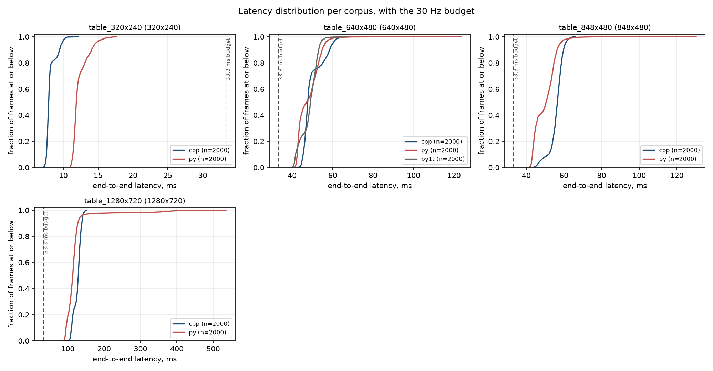
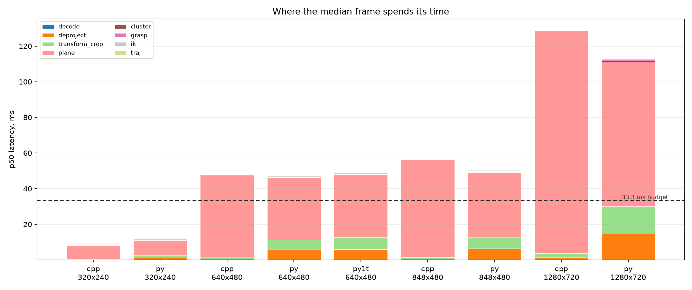
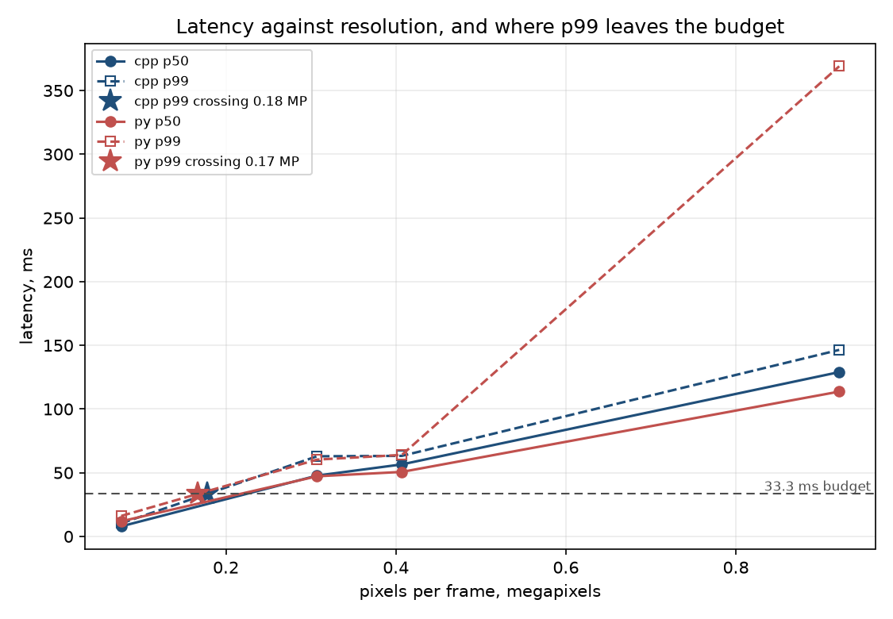
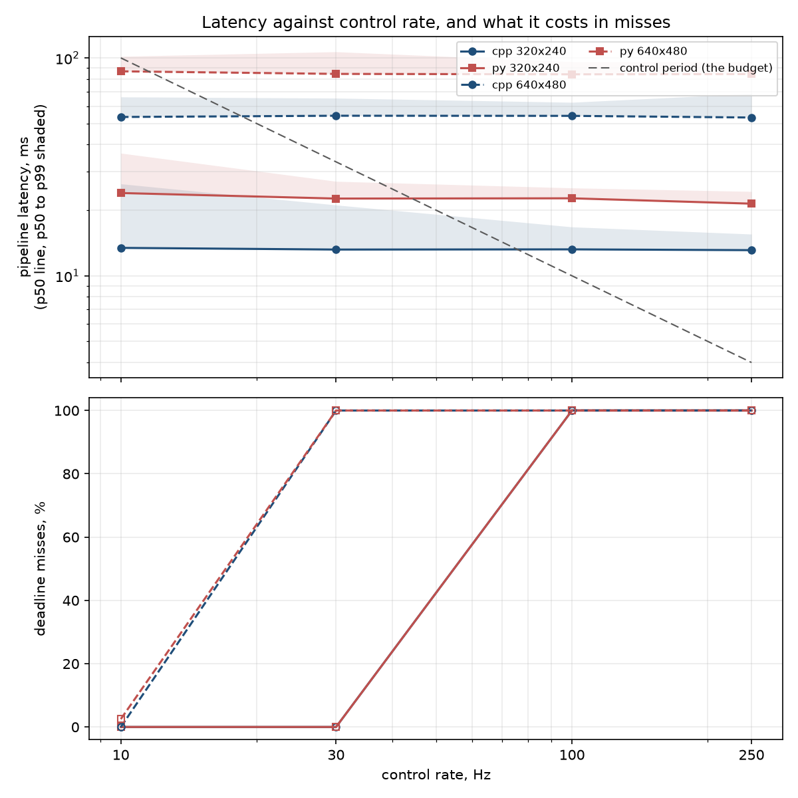
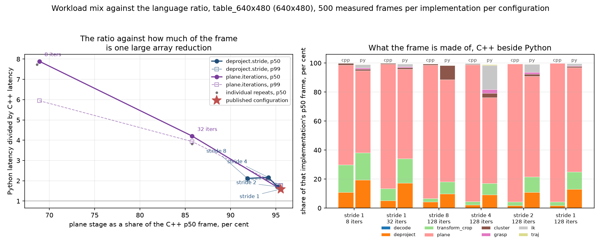

# ros2-grasp-latency

**How much end-to-end latency does writing a ROS 2 grasp node in Python cost
against the same pipeline in C++, from RGB-D frame to joint command, and at
what control rate does it matter?**

One frozen 8-stage spec ([docs/ALGORITHM.md](docs/ALGORITHM.md)), two
implementations of it, the same recorded bytes into both, and an equivalence
gate that has to pass before any latency number is quoted.

## The answer

**Nothing, on this pipeline. And that is the interesting part.**

`table_640x480`, 2000 measured frames per implementation, all runs back to back
in one window, gate green, milliseconds:

| implementation | p50 | p95 | p99 |
| :--- | ---: | ---: | ---: |
| C++, Eigen 3.4, `-O2 -DNDEBUG` | 47.7 | 60.2 | 62.9 |
| Python, NumPy 2.4 and SciPy 1.17 | 47.2 | 56.3 | 60.3 |
| Python, `OPENBLAS_NUM_THREADS=1` | 49.1 | 54.0 | 56.3 |

Python costs **0.99x at p50 and 0.96x at p99**, which is to say it costs
nothing measurable. Rewriting this node in C++ would not have bought a
millisecond.

That is not because Python is fast. Per stage:

| stage | cpp p50 | py p50 | ratio |
| :--- | ---: | ---: | ---: |
| deproject | 483 us | 5736 us | 11.9x |
| transform and crop | 785 us | 6100 us | 7.8x |
| **plane, RANSAC** | **46426 us** | **34155 us** | **0.7x** |
| cluster | 41 us | 333 us | 8.1x |
| grasp synthesis | 8 us | 226 us | 27.9x |
| inverse kinematics | 12 us | 537 us | 43.4x |
| trajectory | 1.5 us | 24 us | 16.2x |

Python is 8x to 43x slower on every stage that iterates, and it loses by 186x
on message decode. It is **30 percent faster** on the one stage that is a
single large matrix product, because NumPy issues 128 RANSAC candidates against
212,574 points as blocked BLAS `dgemm` while the C++ walks a scalar loop over
the same arithmetic. That stage is 97 percent of the C++ frame, so it decides
the total and everything else is rounding.

The transferable claim is therefore not a ratio. It is this: **the language
gap is a property of how much of your frame is one large array operation.** The
workload sweep below measures that directly, and the ratio moves from 0.7x to
7.89x as the vectorised stage stops dominating.

**Do not read the absolutes to three significant figures.** The same binary on
the same corpus measured p50 between 47.7 and 58.1 ms across runs in one
session, about 20 percent, with no matching signal in the load average. Run
length is not the cause, which was tested at 250, 500 and 2000 frames. A
controlled three-core memory-bandwidth stressor moves both implementations by
the same 1.04x and leaves the ratio unchanged, so contention is not the cause
either. The source of the remaining variance was not isolated, and the honest
reading is that this shared vCPU supports two significant figures and a ratio
measured inside one window, not more.

**The C++ number is also a flag choice.** The table uses the pinned
`-O2 -DNDEBUG`. Rebuilt with `-O3 -march=native` the same C++ runs its plane
stage in 31.0 ms rather than 50.6 ms in the same window, 1.59x faster, which
would put C++ ahead. `-O3` alone is *slower* than `-O2` here, at 0.94x.
`-march=native` enables FMA contraction so it changes the arithmetic and the
binary; it changes the answers by 1e-14, checked through the same equivalence
gate. See [results/compiler_flags.json](results/compiler_flags.json).

**Neither implementation holds a 33.3 ms budget at 640x480.** At 320x240 both
do. Driven by a scheduler with absolute deadlines, at 640x480 both miss every
deadline at 30 Hz. **At this resolution the pipeline is the problem and the
language is not**, and porting it to C++ does not fix it.

### Why the whole pipeline is at parity when single stages are 43x

Per stage at 640x480, p50, in microseconds, ordered by what the stage costs
C++:

| stage | cpp p50 | py p50 | ratio | share of the cpp frame |
| :--- | ---: | ---: | ---: | ---: |
| plane (RANSAC) | 55,485.62 | 62,280.07 | 1.1x | 95.6% |
| transform and crop | 1,435.90 | 11,007.78 | 7.7x | 2.5% |
| deproject | 915.85 | 10,801.85 | 11.8x | 1.6% |
| cluster | 88.18 | 595.11 | 6.7x | 0.2% |
| IK | 26.25 | 1,260.28 | 48.0x | 0.0% |
| grasp | 13.82 | 461.39 | 33.4x | 0.0% |
| trajectory | 1.44 | 56.85 | 39.4x | 0.0% |
| decode | 0.03 | 10.55 | 422.0x | 0.0% |

One stage is 95.6% of the C++ frame, and it is the one stage where Python is
1.1x rather than tens of times slower. RANSAC plane scoring is a large array
reduction: Python issues it as a handful of NumPy calls per block of points and
then waits inside compiled loops. The stages where the interpreter is charged
per call rather than per element are 48x, 39x and 33x slower, and they are 1.5%,
0.1% and 0.5% of the Python frame. The whole-pipeline ratio is modest because
of the mix, not because the interpreter is close to compiled code.

So the headline is a property of this pipeline's shape, and the shape was swept
rather than hedged about. `harness/workload_sweep.py` shrinks the plane stage
two ways: `deproject.stride` divides the point count by its square,
`plane.iterations` divides the candidate count. 500 measured frames per
implementation per configuration, every configuration through the equivalence
gate before its row was kept:

| stride | plane iterations | plane share of the cpp frame | py:cpp at p50 |
| :--- | ---: | ---: | ---: |
| 1 (published) | 128 | 95.5% | 1.59x |
| 2 | 128 | 95.2% | 1.71x |
| 4 | 128 | 94.2% | 2.17x |
| 8 | 128 | 91.9% | 2.12x |
| 1 | 32 | 85.8% | 4.20x |
| 1 | 8 | 68.9% | 7.89x |

**The ratio moves from 1.59x to 7.89x as the plane stage falls from 95.5% to
68.9% of the C++ frame.** Compare rows inside this table and not against the
headline. The sweep re-measures its own baseline row rather than borrowing the
headline's, precisely because a figure from another window is not comparable on
this machine: its baseline reads 1.59x where the headline table reads 0.99x for
the same configuration, and the gap between those two is the measurement
variance described above, not a difference in the pipeline. The transferable part is not the six rows. It is the axis they are
plotted against: the share of the frame that is one large array reduction
predicts the ratio better than the choice of language does, and a pipeline that
subsamples its cloud or runs a shorter RANSAC should read the row that matches
its shape.

Two of those rows are also a warning about the knob rather than the language.
At stride 8, 450 of 500 samples find no cluster and stop early, so that row
mostly times a pipeline with no grasp synthesis, IK or trajectory in it:
subsampling that hard takes the object out of the cloud along with the cost.
At stride 4 the same thing happens to 15 of 500 samples.

One more reading of the same point, from the resolution table. 848x480 has a
third more pixels than 640x480 and costs about the same in both languages,
because the workspace crop leaves 212,576 points against 212,574. A wider
sensor mode at the same focal length sees more table, not more object, and the
crop throws the difference away. Cost tracks points surviving the crop, not
pixels, which is why the resolution axis of the crossover is really a
point-count axis.

## Plots

All committed, all regenerated by the harness that produced the numbers.



Empirical CDF per corpus with the 33.3 ms budget marked. At 640x480 both curves
sit entirely to the right of the budget line.



The stage breakdown above, drawn. The plane stage is nearly the whole bar in
both implementations.



p50 and p99 against pixel count for both implementations, with the interpolated
budget crossing.



Compute time, response time and deadline misses at 10, 30, 100 and 250 Hz.
Response time is release to finish, so it carries the backlog an overrun leaves
behind, which is what a downstream controller waits for.



The ratio against the plane stage's share of the C++ frame, and what each
frame is made of on both sides.

## What was surprising or did not work

**The IK converged on 0 of 100 targets, and the cause was in the spec.** The
solver was not failing to converge: it was converging to a fixed point outside
the 0.5 mm tolerance, with `dq` decaying to zero. The null-space term was
`I - J^T (J J^T + lambda^2 I)^-1 J`, which is not a null-space projector while
`lambda > 0`. It differs from the true projector by `O(lambda^2)`, so the
posture bias leaks into task space, is balanced against the task error instead
of being driven out of it, and parks the solution outside tolerance. Swept
against the damping, the gain is what is responsible: at the configured damping
of 0.05, gain 0 and 0.01 reach 100 of 100 targets, gain 0.02 reaches 95, and
gain 0.05 upward reaches none and burns all 100 iterations on every frame,
parking 1.90 mm from the target against a 0.5 mm tolerance. What fails is
position, not orientation: at gain 0.1 the position error reaches 2.87 mm while
the orientation error stays inside 1.45 mrad of a 5 mrad tolerance. At
damping 0.005 and below every gain in the sweep reaches every target, so the
term is not fatal in itself, it is fatal at the damping this pipeline runs. A
true pseudo-inverse projector converges and costs an SVD per iteration on a
stage that runs every frame; since every solve is seeded from `q_neutral` the
answer already sits near the neutral posture, so `ik.nullspace_gain` is 0. This
mattered for the headline, not just for correctness: a non-converging IK runs
100 iterations instead of a median of 9, which would have inflated the stage
where Python is weakest by roughly ten times and called it a language cost.
The sweep is in [docs/METHOD.md](docs/METHOD.md) section 11 and
`results/nullspace_sweep.json`.

Worth recording alongside it: an earlier revision of the spec blamed that
failure on a 198 mrad orientation error, and that figure does not reproduce
against the shipped pipeline. It was measured before the wrist fold below
existed. The 0 of 100 result reproduces, the diagnosis was corrected, and the
failure is in position, not orientation.

**The grasp closing-axis sign was resolved from the eigenvector, not the
wrist.** A parallel-jaw gripper is symmetric about its closing axis, so closing
along `+y` and along `-y` are the same physical grasp. The spec picked between
them with the eigenvector canonicalisation, which decides from the
eigenvector's components and knows nothing about the arm. That confines the
demanded yaw to two quadrants and can ask joint 7 for 180 degrees of travel
from `q_neutral`, against 125 degrees of upward headroom, so some grasps were
orientation unreachable and IK burned its whole iteration budget failing to
reach them. S5 now folds the sign toward the wrist's rest orientation, computed
once at construction so nothing enters the measured path. Verified by sweeping
object yaw over a full turn: worst demanded travel goes from 180 degrees to 90.
It changes which of two equivalent frames is reported, not which object is
grasped or where.

**The garbage-collection hypothesis is not supported, and the instrumentation
was built to test it.** Every Python timing record carries the CPython
collection counters per generation, sampled through a `gc.callbacks` hook, so
the frames a collection landed on are known rather than guessed. Over 2000
measured frames at 640x480 there is **one** collection, in generation 0. It
lands on one frame, 0.1% of the run. Removing that frame moves p99 by 0.0%,
from 107.194 ms to 107.194 ms. Collections are no more common among tail frames
(0.0%) than overall (0.1%), and the point-biserial correlation between "a
collection fired" and frame latency is +0.044. The same holds on all four
corpora. The Python tail is not the collector, which leaves allocator behaviour
and scheduler noise, and threat T2 measured how much of it is the box: on a
machine shared with a neighbouring workload the same run reported p99 232.3 ms
against 107.2 ms quiet, an inflation of 2.17x. That is why every published
figure comes from the quiet run and why the medians are the numbers to lean on.

**NumPy's BLAS was quietly using four cores against the C++ build's one.** The
plane stage's block scoring is a real `dgemm`, and NumPy here links against a
`scipy-openblas` built with `MAX_THREADS=64`. Measured, the Python process ran
at 3.87 cores against C++'s 0.99. What it does not do is convert that into
latency: pinning it to one thread costs 9% of wall-clock p50 and saves 111 CPU
seconds out of 152 over the same 400 frames, because the matrices are too small
for four threads to beat their own synchronisation. Two consequences that point
opposite ways. The latency ratio is not an artefact of Python being handed more
cores, since the pinned row is within a few percent of the unpinned one. But
the cost ratio is far worse than the latency ratio, and on a four-core
controller running a planner and a driver next to the perception node, burning
3.9 cores to save 9% of one node's latency is the wrong trade. A deployment
should set `OPENBLAS_NUM_THREADS=1` and take the pinned number. Both rows are
published.

**The first camera extrinsic put zero table pixels in the workspace.** The
`T_base_cam` first written had a rotation that put the camera behind the base
looking along `+x` instead of above the table looking down, so the deprojected
table landed outside the workspace crop entirely and every stage after the crop
saw an empty cloud. Corrected to a right-handed frame with `det(R) = +1`, the
optical axis mapping to base `-z`, 0.85 m above and 0.30 m in front of the
base. The same commit added `tests/test_config_is_sole_source.py`, which
polices 39 distinctive constants and fails if either implementation types one
in rather than reading it from `assets/pipeline_config.json`.

**A tuning constant chosen for one configuration became a tax on another, and
re-choosing it by measurement found an overflow.**
`implementation.ransac_block_points` is read only by the Python plane stage and
its committed value of 512 was picked when the distance block was 512 x 128
float64. Shrink the candidate count and the block stops filling the cache while
the Python loop still runs once per 512 points. Holding it fixed across the
workload sweep would have charged Python 3.5 ms for a stale constant and called
it a language cost, so every row re-picks it the way the committed value was
picked. That calibration reached a 131,072-point block, `plane.py`'s `int16`
inlier accumulator wrapped, RANSAC picked a different candidate from the C++
implementation, and the gate failed with plane normals 0.139 apart and
`graspable` disagreeing on two frames. The config file still claims any value
of that key gives bit-identical output; it holds only below 32,767. The sweep
now caps its candidates there. This is the equivalence gate paying for itself:
a silent wrong answer, caught by a comparison rather than by a test that knew
to look.

**The equivalence gate found a real bug, which is what it is for, and fixing it
cost 24 percent until the fix was measured.** The Python plane stage
accumulated each block's inlier count in an `int16`, under a comment asserting
a block could not overflow it. A block holds `ransac_block_points` rows, so
anything above 32767 wraps. The workload sweep's block calibration reached
131072 points, the counts went negative, RANSAC selected a different candidate
from C++, and the two implementations disagreed by 0.139 in the plane normal
and 0.0395 rad in the joint solution. `pipeline_config.json` had claimed of
that key that "any value gives bit-identical output".

Forcing the accumulator to `int32` fixed it and cost 14.7 ms on the stage that
dominates the frame, 61.2 ms to 75.9 ms, which only showed up because the fix
was re-measured rather than assumed free. The width is now chosen from the
block size, so the shipped configuration pays nothing and the overflow is
impossible at any setting.
[`test_block_size_invariance.py`](python/tests/test_block_size_invariance.py)
pins it at 512 through 131072 points, asserting bit-identical output rather
than a tolerance, and was itself checked by restoring the bug and watching it
fail.

**The machine drifts 12 percent and two plausible explanations for it were
both wrong.** The same binary on the same corpus measures 56.6 to 60.7 ms p50
across runs. The first guess was that the slow runs were contaminated by
concurrent load; re-running on an idle machine produced a slightly *slower*
number, so that was wrong. The second guess was that short runs were the honest
ones, since a 250-frame run had read 53.0 ms; running 250, 500 and 2000 frames
twice each put them all in one band, so that was wrong too. What is left is a
shared vCPU whose throughput varies over tens of minutes with no signal in the
load average.

The consequence is the reason every table here is a paired measurement: an
absolute latency from this machine is worth about two significant figures, and
a ratio measured inside one window is worth more than either number in it.
Quoting a p50 to three decimals, as an earlier revision of this README did,
implied a precision the hardware cannot deliver.

## How to reproduce

Nothing here needs ROS 2 except the ROS 2 numbers, and there are no ROS 2
numbers. Everything in `results/` is the in-process pipeline.

### Without Docker: every number in this README

Ubuntu 24.04 with `g++`, `cmake` and `libeigen3-dev`. The corpora are generated
rather than committed, and the first run writes them into `data/`: the
100-frame store at 640x480 is about 150 MB of depth and colour, and 1280x720 is
larger.

```bash
python3 -m venv .venv && . .venv/bin/activate
pip install -r requirements.txt          # versions are pinned, and why is in the file
cmake -S cpp -B cpp/build -DCMAKE_BUILD_TYPE=Release
cmake --build cpp/build -j"$(nproc)"

harness/run_all.sh                                          # tens of minutes
FRAMES=50 WARMUP=10 RATE_SWEEP_JOBS=20 harness/run_all.sh    # smoke pass
```

`run_all.sh` generates the four corpora, builds the C++ core, runs the unit
tests, runs both benchmarks at every resolution, takes the extra
single-BLAS-thread Python pass, runs the equivalence gate, runs the control-rate
sweep and writes `results/RESULTS.md`. The gate sits in the middle rather than
at the end on purpose: if the two implementations disagree, every latency number
below that line is a comparison between two different programs, so the run
stops.

The suites are 6 of 6 C++ tests and 66 of 66 Python tests. The stages can also
be run individually:

```bash
./cpp/build/bench_pipeline --dataset data/table_640x480 \
  --out-timing results/cpp.table_640x480.timing.jsonl \
  --out-output results/cpp.table_640x480.output.jsonl --warmup 100 --frames 2000
python3 python/bench/bench_pipeline.py --dataset data/table_640x480 \
  --out-timing results/py.table_640x480.timing.jsonl \
  --out-output results/py.table_640x480.output.jsonl --warmup 100 --frames 2000

python3 harness/compare_outputs.py \
  results/cpp.table_640x480.output.jsonl results/py.table_640x480.output.jsonl
python3 harness/rate_sweep.py --out-dir results --build-dir cpp/build --data-root data
python3 harness/analyze.py results/*.timing.jsonl --out-dir results --data-root data
```

`harness/analyze.py` needs at least two resolutions to interpolate the budget
crossing. The two side experiments:

```bash
python3 harness/workload_sweep.py --dataset data/table_640x480 --out-dir results
python3 tools/fill_method_placeholders.py --measure-nullspace
python3 tools/check_style.py            # no em dashes, no quality adjectives
```

### With Docker: the ROS 2 layer, which has produced no number yet

ROS 2 cannot be installed in the container this repository was written in, so
`ros2_ws/` and `docker/` are built and run inside the image and nowhere else.
CI compiles the workspace and starts both nodes on every commit, which proves
they build and start and proves nothing about their latency.

```bash
docker build -f docker/Dockerfile -t grasp-latency-ros .
python3 harness/make_dataset.py --name table_640x480
docker run --rm -it \
  -v "$PWD/data:/workspace/data" \
  -v "$PWD/results:/workspace/results" \
  grasp-latency-ros \
  docker/run_ros_benchmark.sh --mode all
```

That produces four timing files in the same format the in-process runs use:
the rclcpp node, the rclpy node, a composed C++ node over the RMW, and the same
composed node with intra-process delivery. **None of those numbers exist in
this repository, and none is quoted anywhere in it.** Anything involving DDS,
CDR serialisation, executor dispatch, rclpy message conversion or
intra-process delivery needs a host with Docker. Everything above this section
does not. [docs/ROS2.md](docs/ROS2.md) ends with the inventory of what has and
has not been run.

## What is and is not measured here

Measured: the pipeline from raw depth and colour buffers to a joint trajectory,
in process, on one machine, on a synthetic corpus, with nine clock reads per
frame and nothing inside the measured region but the pipeline. Both
implementations must agree to 1e-6 before any timing is quoted; the worst
deviation observed anywhere across five comparisons is 2.9e-13 radians in the
joint solution, which is 3.5e6 times inside the tolerance.

Not measured, each one written up at length in
[docs/METHOD.md](docs/METHOD.md):

* **T1**, the pipeline's shape decides the answer. Swept, and the sweep is the
  table above.
* **T2**, four shared vCPUs with no pinning or isolation. p99 and the maximum
  are upper bounds for this stack rather than clean measurements. Sized by
  running the whole benchmark under load and quiet.
* **T3**, ROS 2 is absent, so the transport is not measured. The ratio here is
  a lower bound on the language cost of a ROS 2 grasp node, since rclpy pays
  conversion costs rclcpp does not.
* **T4**, this measures Python plus NumPy against C++ plus Eigen, not
  interpreted against compiled. There is no numba, no Cython and no C extension
  of our own, because the question is what an ordinary rclpy node costs.
* **T5**, the corpus is graspable on 100% of frames by construction, so the
  zero bail-out rate is a property of the generator, not a result.
* **T6**, depth comes from an analytic ray-caster with a noise and dropout
  model, not a sensor. No multipath, no flying pixels, no temporal correlation.
* **T7**, one machine, one compiler, one BLAS, one libc. In particular the C++
  side is built at `-O2 -DNDEBUG`, which is the conservative choice for C++ and
  the generous one for Python. `results/compiler_flags.json` holds a 250-frame
  comparison of `-O2`, `-O3` and `-O3 -march=native` on this corpus that no
  number in this README uses and that was not put through the equivalence gate.
  Read it before quoting the headline as the last word on the C++ side.
* **T8**, the effective sample size is 100 distinct frames, not 2000 samples.
  The published interval is the frame-blocked bootstrap for that reason.
* **T9**, the rate sweep reaches the C++ pipeline through `ctypes`, at 383 ns
  per call, so that both implementations run under one scheduler.
* **T10**, the gate bounds agreement, not correctness. Two implementations of a
  wrong spec would pass it together. Correctness against the spec is the unit
  tests and a forward-kinematics cross-check against MuJoCo.

## Repository layout

```
docs/ALGORITHM.md     the frozen 8-stage spec: S0 decode to S7 trajectory
docs/METHOD.md        how the measurement is made, and threats T1 to T10
docs/FORMATS.md       the timing, output and manifest wire formats
docs/ROS2.md          the node design, the QoS decisions, what is unverified
docs/TOOLCHAIN.md     the machine every number came from

assets/               pipeline_config.json, the Panda chain, the RANSAC
                      deviate table. Every constant either pipeline reads.
cpp/                  grasp_core, the benchmark runner, 6 tests
python/               grasp_core, the benchmark runner, tests
harness/              dataset generator, equivalence gate, rate sweep,
                      workload sweep, analysis, run_all.sh
tools/                style checker, chain extractor, doc placeholder filler
ros2_ws/              rclcpp and rclpy node packages, built only in Docker
docker/               the ROS 2 image and the node benchmark script
results/              RESULTS.md, the aggregates as JSON and CSV, the plots
```

`data/` and the per-frame timing JSONL are regenerated rather than committed.
The aggregates, the equivalence reports and the plots are committed, so every
figure quoted here can be traced to a file without rerunning anything.

Conventions this repository holds itself to, including the ones a script
enforces, are in [CONTRIBUTING.md](CONTRIBUTING.md). Licence: MIT, see
[LICENSE](LICENSE).
